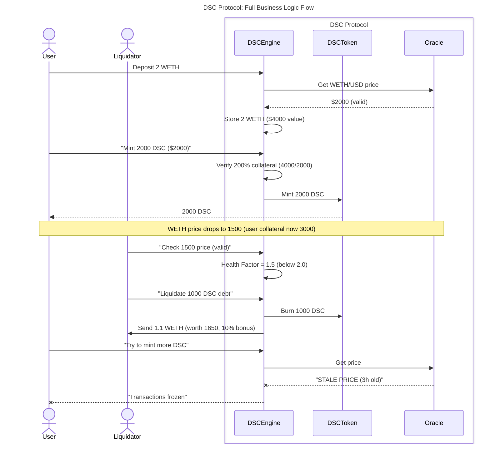

# DSC - Decentralized Stable Coin

[](https://soliditylang.org/)
[](https://opensource.org/licenses/MIT)
[](https://getfoundry.sh/)

## Core Protocol Mechanics

### Collateralization System
- **200% Minimum Collateralization** (Liquidation at 50% LTV)
- **Multi-Asset Backing**: ETH and BTC as collateral
- **Dynamic Peg Maintenance**: Algorithmic stabilization

### Liquidation Engine
- **10% Liquidation Bonus** for incentivization
- **Health Factor Monitoring**:
  ```solidity
  HealthFactor = (CollateralValue * 0.5) / DebtValue
  ```
- **Thresholds**:
  - Safe: > 1.0
  - Liquidatable: ≤ 1.0

## Advanced Features

### Oracle Integration
- Chainlink Price Feeds with 8 decimal precision
- Staleness checks via `OracleLib.sol`
- Price calculations with 18 decimal standscdization

### Security Architecture
- Reentrancy guards on all state-changing functions
- CEI (Checks-Effects-Interactions) pattern enforcement
- 100% test coverage including fuzz tests

## Technical Specifications



## Development

```bash
# Run tests
forge test -vv

# Fuzz testing
forge test --match-test invariant

# Deploy to Sepolia
make deploy ARGS="--network sepolia"
```

## License
MIT

## 🚀 Thank You!

[](https://www.linkedin.com/in/abusalama/)  
[](https://github.com/aiabusalama)  
